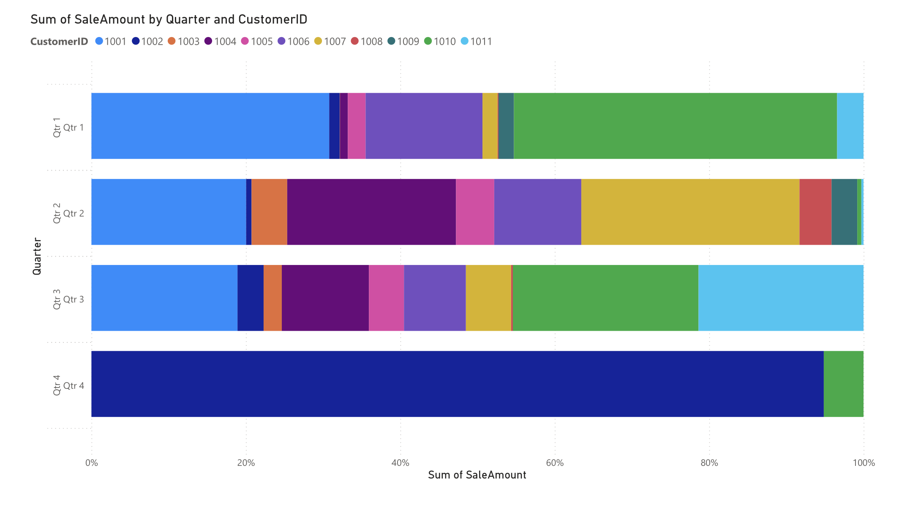
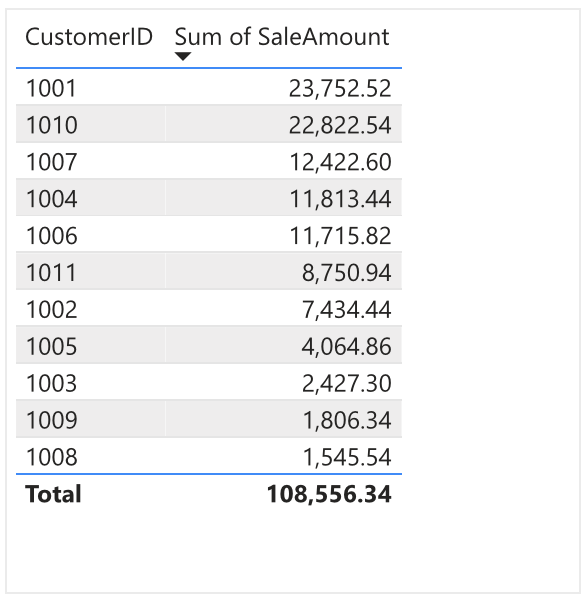
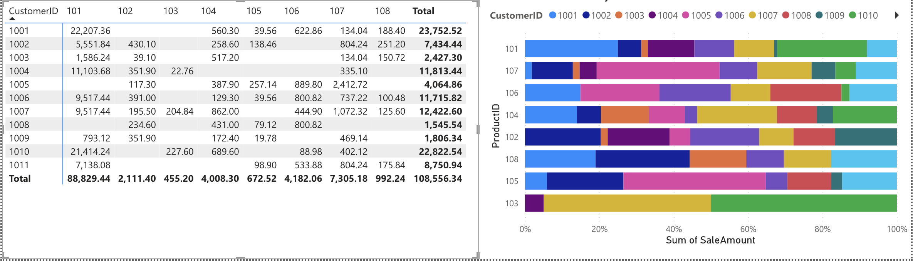
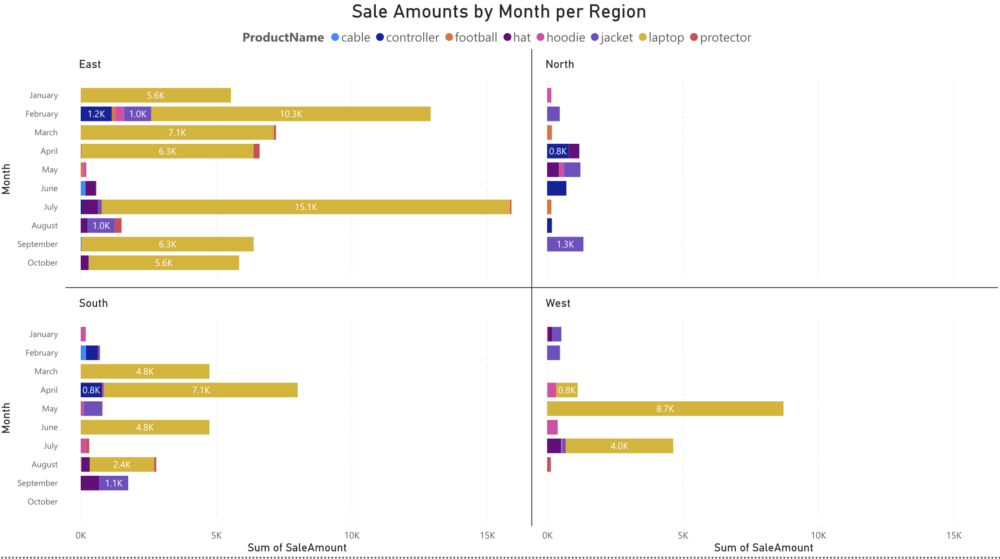
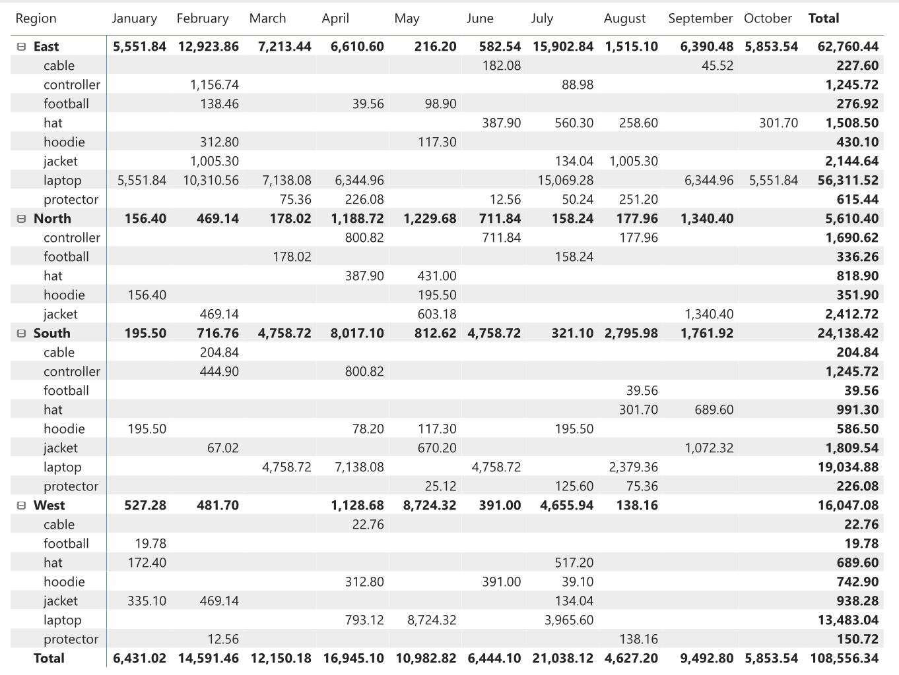
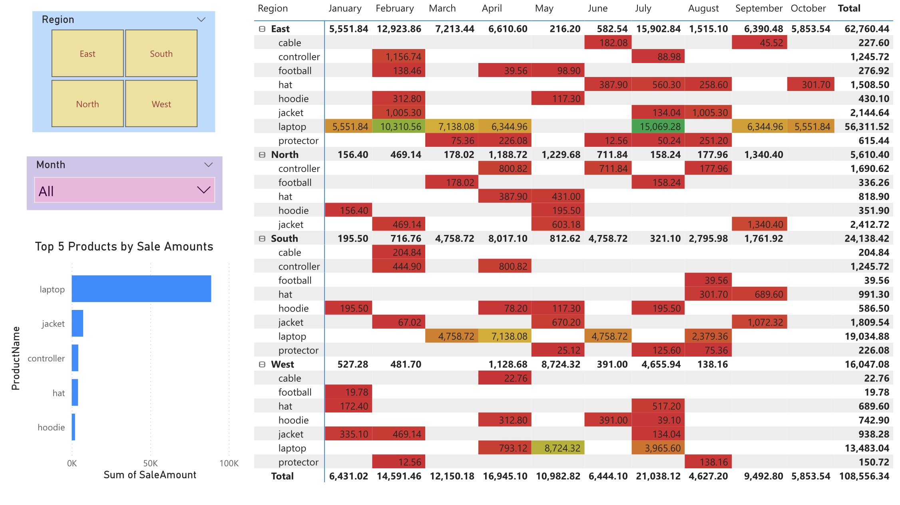

# smart-store-ioo
-----

## Project Setup Guide (1-Mac/Linux)

Run all commands from a terminal in the root project folder. 

### Step 1A - Create a Local Project Virtual Environment

```shell
python3 -m venv .venv
```

### Step 1B - Activate the Virtual Environment

```shell
source .venv/bin/activate
```

### Step 1C - Install Packages

```shell
python3 -m pip install --upgrade -r requirements.txt
```

### Step 1D - Optional: Verify .venv Setup

```shell
python3 -m datafun_venv_checker.venv_checker
```

### Step 1E - Run the initial project script

```shell
python3 scripts/data_prep.py
```

### Step 1F - Run the Data Preparation Scripts to cleanup the data

```shell
python3 scripts/data_preparation/prepare_customers_data.py
python3 scripts/data_preparation/prepare_products_data.py
python3 scripts/data_preparation/prepare_sales_data.py
```

Customer Data Cleanup- removed duplicate custer ID 1011, same name as customer 1010
Products Data Cleanup - updated spelling of nintendo
Sales Data Cleanup - removed aplha chara on row 9 BonusPoints 

### Run the Data Preparation Scripts to cleanup the data with data scrubber
```shell
python3 scripts/data_prep_customers.py
python3 scripts/data_prep_products.py
python3 scripts/data_prep_sales.py
```

Customer Data Cleanup- removed duplicates and LoyalityPoints range (0, 1000)
Products Data Cleanup - removed duplicates, YearAdded range (1990,2025)
Sales Data Cleanup - checked for duplicates

### Create Database

Created the create_dw.py script that create the database.  Using the etl_to_dw.py script, tables where created based on the schemas.  

### Issues with Loading tables

I was unable to load the tbales necessary for module 5

----

## Module 6 
### Section 1. The Business Goal 
Customer total revenue per quarter, per product. Having this information allows us to know where most of our revenue is coming from and determine if customer are being lost or realtionships are strong. 
###  Section 2. Data Source
I started with my sales_data_prepared file.  This data was uploaded into Power BI.  The columns utlized are:SaleDate, CustomerID, SalesID, ProductID 
### Section 3. Tools
I utilized Power BI, due to my past familiarity with using this tool. I knew I would be able to drill down the information and create the visualization need. 
### Section 4. Workflow & Logic
I summed the total revenue by customer for the year.  I also looked to see what quarter those sales came in by customer to detemrine if the customer regularly shopped with us or if it was a one time purchase.  I also reviewed the products that were bought the most per each customer. 
- Tables: sales
- Columns: productID, customerID, sale_date, sale_amount
- Workflow: Aggregate by product and customer category, calculate total sales per quarter 
- Output: Bar chart + summary table
### Section 5. Results
 
 
 
Explain any suggested actions based on the results you uncovered.
### Section 6: Suggested Business Action 
Customer ID 1001 and 1010 bring in the highest reveune of sales.  These customers should be targeted for loyalty programs, upselling, or exclusive offers.  Customers with less than 10k revenue for the year, should be targeted for promotional incentives.
### Section 7. Challenges
none

-----

# Module 7 Project
## Section 1. The Business Goal
Identify the most profitable product by month and region.
## Section 2. Data Source
sales_data_prepared and customer_data_prepared file.  I combined these files in order to be able to do the required analysis in Power BI.
## Section 3. Tools Used
Power BI
## Section 4. Workflow & Logic
I combined the the sales_data_prepared and customer_data_prepared file; this new file is called sales_customer_data_prepared. The region was in the customer file and this is a needed splicer for this analaysis. I then summed the total revenue by product for each month in each region.  
- Tables: sales, customer, product
- Columns: productID, customerID, sale_date, sale_amount, region, product_name, category
- Workflow: Aggregate by product name and region category, calculate total sales per month 
- Output: Bar chart + summary table
## Section 5. Results (narrative + visualizations)


### Summary


### Dashboard

## Section 6. Suggested Business Action
Laptops dominate revenue across all regions and months. 

**East**: Consistently strong across all months. Dominated by laptops.
*Action: Expand laptop offerings – Add accessories (e.g., high-end cases, extended warranties). Launch loyalty or membership programs for frequent tech buyers. Use the East region as a pilot market for new laptop-related products or bundles.*

**South**: Major spike in March and April driven by laptops and jackets.
*Action: Run seasonal campaigns in Q1–Q2. Consider stocking lighter apparel post-April. Target universities or educational programs with student-focused laptop campaigns in early spring.*

**North**: Laptops are nearly absent. Lower totals, but jackets and hats do fairly well in spring and fall.
*Action: Focus on seasonal promotions (e.g., spring outerwear). Boost regional awareness with targeted ads.*

**West**: Peaks in April and June from laptops and hats.
*Action: Push smart product bundles (e.g., laptop + hoodie + protector). Launch summer offers early (April–June).*

## Section 7. Challenges
My biggest challenge was being able to drill down my visulaizations for what I want it to look like. 

## Section 8. Ethical Considerations
**Risk**: Over-prioritizing certain regions or demographics while neglecting others may unintentionally reinforce inequality or limit opportunities.
**Ethical Action**: Apply equity-based thinking — make sure all regions get access to quality products, support, and offers. When investing more in high-performing areas, also consider strategies to uplift underserved regions (e.g., North).

## Commands Used (Frequently) to update GitHub 
```
# to check the status
git status
# to stage the files
git add .
# to commit with message
git commit -m "<<message to commit>>"
# to push into remote branch
git push -u origin main

git add .
git commit -m "Completed custom BI project"
git push -u origin main

```